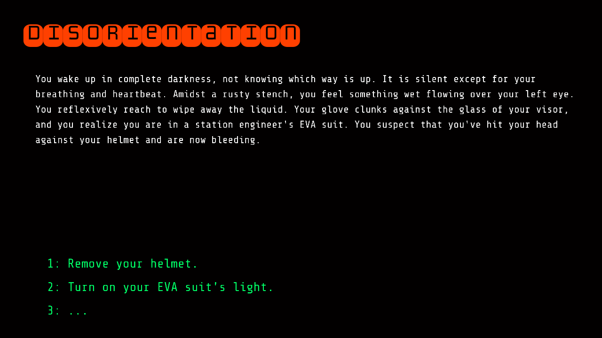

# Escape from Lagrange Station

Author: Henry Du

## Design:

This game is a short text adventure game where you wake up after an accident on a space station situated at Earth's L2 Lagrange point. It is a plot-driven game where you must make correct decisions to reach the ending.

## Text Drawing:

Text is shaped and rendered at runtime using HalfBuzz, FreeType, and OpenGL. The pipeline code is heavily based on the HalfBuzz-FreeType and OpenGL-FreeType tutorials in the sources section at the end. The text rendering pipeline boils down to:
1. Perform line-wrapping by repeating shaping, checking the line length, and splitting it at the last encountered whitespace if necessary
2. For each line:
3. Shape the text with HalfBuzz
4. Render glyphs with FreeType
5. Draw glyphs using OpenGL
Glyphs are cached in a hashmap from HalfBuzz glyph index to a Glpyh structure inspired by the OpenGL-FreeType tutorial.

## Choices:

The game represents choices in the form of a state graph that is defined in python and serialized to a .csv-like format. This mechanism is used since it's easy to use a JSON-like scheme to represent a graph in Python and also simple to serialize that to something easily readable in C++.

The state graph itself is just list of nodes that each contain a state name, a state description, and up to 3 choices. Each choice has its own description and a destination state for when the choice is taken.

## Screen Shot:

## How To Play:

The player can make choices with keyboard keys `1`, `2`, and `3`. The game can be restarted by pressing `r` at any point. The goal is simply to reach the ending (not a "Game Over" but "END").

## Sources:

This game makes use of two fonts found on Google Fonts. Both are licensed under the Open Font License, which has been included in the `dist/fonts` directory along with the font files.
Share Tech Mono: https://fonts.google.com/specimen/Share+Tech+Mono
Monofett: https://fonts.google.com/specimen/Monofett

This game's text rendering pipeline is heavily based on code from the following two tutorials:
HalfBuzz-FreeType tutorial: https://github.com/harfbuzz/harfbuzz-tutorial/blob/master/hello-harfbuzz-freetype.c
OpenGL-FreeType tutorial: https://learnopengl.com/In-Practice/Text-Rendering
The text rendering pipeline also pulls from `PPU466.cpp` from the game 1 base code and `Drawlines.cpp` from the game 4 base code.

Code was designed while referencing the following docs as well:
FreeType: https://freetype.org/freetype2/docs/reference/ft2-base_interface.html
HalfBuzz: https://harfbuzz.github.io/harfbuzz-hb-buffer.html

The science knowledge in the game is general knowledge that I've picked up over the years. The game was not written with any science reference, so there may be inaccuracies in the details.

This game was built with [NEST](NEST.md).
